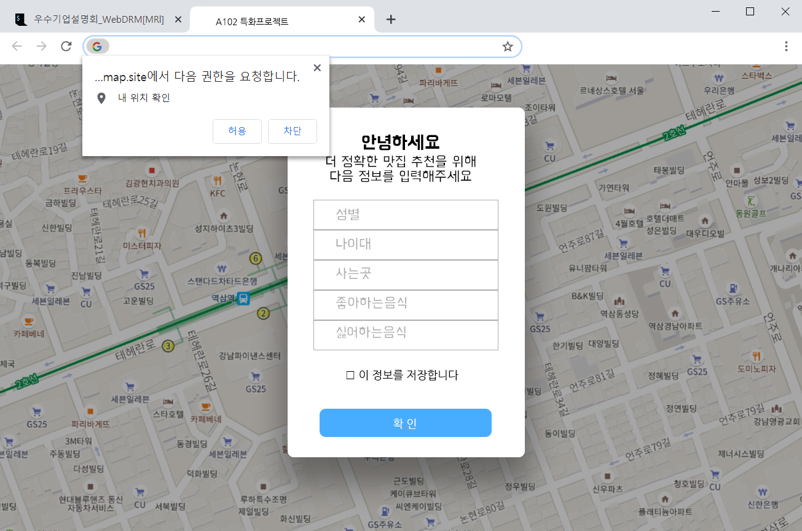
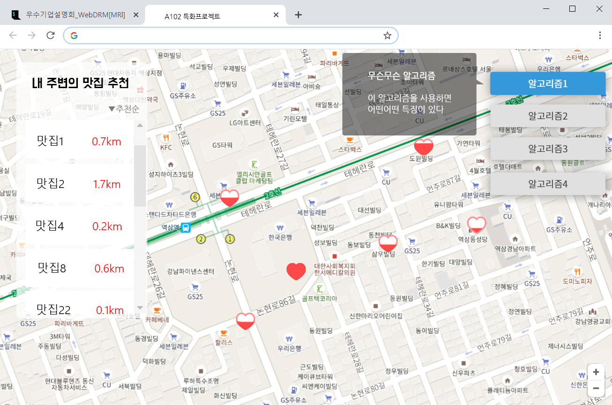
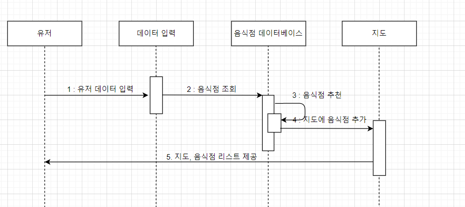

### 데이터

- 사용된 데이터의 경우 SSAFY에서 제공해준 유료데이터로 비포함
- 결과물 확인 => 시연영상

#### 빅데이터 sub2

> Front 프로젝트 생성 참고 : https://github.com/microsoft/TypeScript-React-Starter

## GIT 구조 [참고링크](https://gmlwjd9405.github.io/2018/05/11/types-of-git-branch.html)
- master - dev - feature

## [AWS 정리 링크](document/AWS_.md)
## [REST 정리 링크](document/rest_api.md)


## 와이어프레임



## 시퀀스 다이어그램



```
카드 내역
음식점
날씨


>> 음식점 추천 :: 

카드내역을 통해 사람의 특징을 추측하고 추천
카드내역으로 가계부 :: 
연령도별 음식점 선호도
소비금액 패턴

객단가 : 고객 1인이 결제하는 금액

백엔드 : 석빈 우빈
반반치킨 : 기석
프론트엔드 : 인제 학진
빅데이터

백엔드 : django
프론트 : React, vue
빅데이터 : 나중

데이터화 할것

요일별 영업시간

03-31
데이터를 어떻게 처리하고 DB에 넣을지
(데이터 프레임 어떻게 뭘 만들지 ex: 영업시간이 필요하면 프레임으로 만드는식)

분업을 상세화
데이터 프레임을 테이블화 하자. (ERD cloud)
검색알고리즘 선택하고 공부 후 리뷰 

04-01
백 : 장고
프론트 : 리엑트

04-02
장고 리엑트 통신 테스트(날아온 검색어가 해당 알고리즘으로 잘 가는지. ) - 장고도 스웨거가 같은게 있다.
검색알고리즘 서로 의견 나누기

팀장회의때 물어볼거
1. AWS 언제 주는지
2. 카드 데이터 정확히 

장고 공부하기


```
